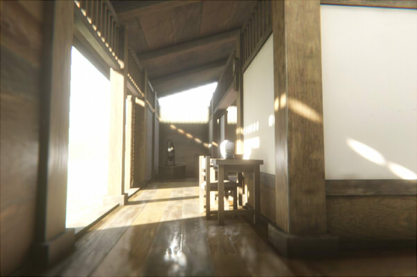

# Unity 2019.3のHDRP(DXRを使用)のサンプルシーン

Unity 2019.3のHDRPでDXRを使用したサンプルシーンです。    

## 確認環境

* OS : Windows 10
* GPU : NVIDIA GeForce GTX 1060 6GB
* Unity : Unity 2019.3.0f6

## スクリーンショット

Tier1を使用し、Ambient Occlusion/Screen Space ReflectionでDXRのレイトレーシングを行っています。    

    

## 使い方

Unity 2019.3以上でないと動作しません。    

GitHubの「Unity2019_3_HDRP_DXR_RoomTest」フォルダの内容をコピーし、UnityHubで読み込むようにしてください。    
Unity Editorでシーンが開かれていない場合は、「Scenes/roomTest.unity」を開くようにします。    

## ライセンス  

This software is released under the MIT License, see [LICENSE](./LICENSE).  

3Dモデルはすべてオリジナルですので、ご自由にご使用くださいませ。    

## 更新履歴

[2020/02/12]    
* 初回版

