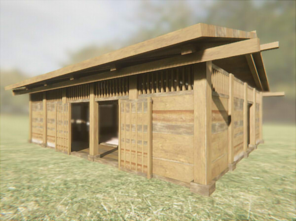
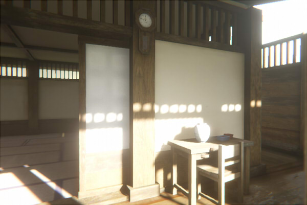

# Unity 2019.3のHDRP(DXRを使用)のサンプルシーン

Unity 2019.3のHDRPでDXRを使用したサンプルシーンです。    

## 確認環境

* OS : Windows 10
* GPU : NVIDIA GeForce GTX 1060 6GB
* Unity : Unity 2019.3.2f1 + HDRP 7.2.1

## スクリーンショット

Ambient Occlusion/Screen Space ReflectionでDXRのレイトレーシングを行っています。    
Lightmap/Reflection Probe/Light Probeを併用しています。    
    
    
    

## 使い方

Unity 2019.3以上でないと動作しません。    

GitHubの「Unity2019_3_HDRP_DXR_RoomTest」フォルダの内容をコピーし、UnityHubで読み込むようにしてください。    
初回は読み込みにすごい時間がかかります。    

Packageのエラーが出る場合は強制的に読み込み、Unity Editor起動後にメインメニューの「Window」-「Package Manager」を選択します。    
「In Project」にし、「Render-Pipelines High-Definition」「High Definition RP」の順番にアップデートするようにします。    
    
アップデート順に注意してください。    
他、バージョンによってカレントのPackageと異なる場合は同様のアップデートを行うようにします。    
開発/確認は、HDRP 7.2.1を使用しました。    
メインメニューの「Window」-「Render Pipeline」-「HD Render Pipeline Wizard」を選択し、エラーがある場合は「Fix All」ボタンを押します。    
    

HDRPを更新後、一度Unity Editorを再起動します。    

Unity Editor上でProjectウィンドウより「Scenes/roomTest.unity」を開きます。    

## このシーンの解説

Qiitaの「 [Unity 2019.3のHDRP (DXR使用)でLightmapと併用 (Tier1)](https://qiita.com/ft-lab/items/72862ce440f36be78293) 」で、本シーンの解説を行っています。    

## ライセンス  

This software is released under the MIT License, see [LICENSE](./LICENSE).  

3Dモデルはすべてオリジナルですので、ご自由にご使用くださいませ。    

## 更新履歴

[2020/02/22]    
* Unity 2019.3.2f1 + HDRP 7.2.1に移行
* Lightmap/Light Probe/Reflection Probeのパラメータを微調整
* マテリアルを微調整

[2020/02/12]    
* 初回版

